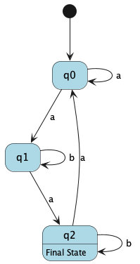
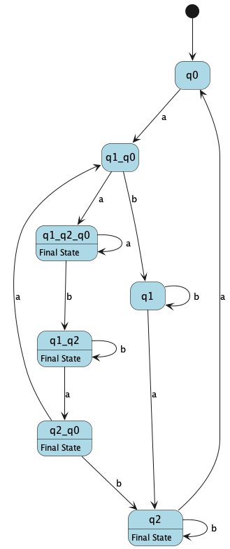

# Determinism in Finite Automata. Conversion from NDFA 2 DFA. Chomsky Hierarchy.

### Course: Formal Languages & Finite Automata
### Author: Adrian Vremere 

----

## Theory

### Determinism in Finite Automata
A **Finite Automaton (FA)** is a mathematical model used for recognizing patterns and languages. It consists of states, transitions, an initial state, and one or more accepting states. Finite automata can be classified into two main types:

1. **Deterministic Finite Automaton (DFA)**:  
   - A DFA has exactly one transition for each symbol of the alphabet from every state.
   - It does not contain ε-transitions (transitions without consuming input).
   - At any given time, the automaton is in exactly one state.

2. **Nondeterministic Finite Automaton (NDFA or NFA)**:  
   - An NDFA can have multiple transitions for the same symbol or ε-transitions.
   - At any given time, the automaton may be in multiple states.
   - It provides a more flexible but equivalent representation of regular languages.

### Conversion from NDFA to DFA
Although NDFA allows multiple transitions, it does not recognize more languages than a DFA. Any NDFA can be converted into an equivalent DFA using the **subset construction method**, which follows these steps:

1. **Create the start state** of the DFA, which corresponds to the ε-closure of the NDFA’s start state.
2. **Generate transitions** for each input symbol by computing the ε-closure of reachable states.
3. **Repeat the process** until no new states are generated.
4. **Mark accepting states** as those containing any of the NDFA's accepting states.

While this conversion can lead to an exponential increase in the number of states, it guarantees an equivalent DFA.

### Chomsky Hierarchy
The **Chomsky Hierarchy** classifies formal languages based on their generative grammars:

1. **Type 0 (Recursively Enumerable Languages)**:  
   - Generated by an unrestricted grammar.
   - Recognized by a **Turing Machine**.
   - Rules: α → β (where α and β are any strings of symbols, α must contain at least one non-terminal).

2. **Type 1 (Context-Sensitive Languages)**:  
   - Generated by a **context-sensitive grammar**.
   - Recognized by a **Linear Bounded Automaton (LBA)**.
   - Rules: αAβ → αγβ (A is a non-terminal, γ is a non-empty string).

3. **Type 2 (Context-Free Languages)**:  
   - Generated by a **context-free grammar (CFG)**.
   - Recognized by a **Pushdown Automaton (PDA)**.
   - Rules: A → γ (A is a single non-terminal, γ is a string of terminals and/or non-terminals).

4. **Type 3 (Regular Languages)**:  
   - Generated by a **regular grammar**.
   - Recognized by a **Finite Automaton (FA)**.
   - Rules: A → aB or A → a (where A and B are non-terminals, and a is a terminal).

This hierarchy provides a structured way to understand the computational power of different classes of languages and their corresponding automata.

##  Objectives:

1. Understand what an automaton is and what it can be used for.

2. Continuing the work in the same repository and the same project, the following need to be added:
    a. Provide a function in your grammar type/class that could classify the grammar based on Chomsky hierarchy.

    b. For this you can use the variant from the previous lab.

3. According to your variant number (by universal convention it is register ID), get the finite automaton definition and do the following tasks:

    a. Implement conversion of a finite automaton to a regular grammar.

    b. Determine whether your FA is deterministic or non-deterministic.

    c. Implement some functionality that would convert an NDFA to a DFA.
    
    d. Represent the finite automaton graphically (Optional, and can be considered as a __*bonus point*__):
      
    - You can use external libraries, tools or APIs to generate the figures/diagrams.
        
    - Your program needs to gather and send the data about the automaton and the lib/tool/API return the visual representation.


## Implementation description

```java
public String getCategory(){
        if(this.rules.keySet().stream()
                .allMatch(t -> this.nonTerminals.stream()
                        .filter(s -> t.contains(s) && t.replaceFirst(s, "").isEmpty()).count() == 1)){
            String endsWithRegex = "^(?:" + String.join("|", this.terminals) + ")*(?:" + String.join("|", this.nonTerminals) + ")$";
            String startsWithRegex = "^(" + String.join("|", this.nonTerminals) + ")(?:" + String.join("|", this.terminals) + ")*$";
            String terminalsOnlyRegex = "^(?:" + String.join("|", this.terminals) + ")+$";
            if (this.rules.values().stream()
                    .allMatch(l -> l.stream().allMatch(s -> (Pattern.compile(endsWithRegex).matcher(s).matches() || s.isEmpty() || Pattern.compile(terminalsOnlyRegex).matcher(s).matches()) )) ||
                this.rules.values().stream()
                    .allMatch(l -> l.stream().allMatch(s -> (Pattern.compile(startsWithRegex).matcher(s).matches() || s.isEmpty() || Pattern.compile(terminalsOnlyRegex).matcher(s).matches()) ))){
                return "Type 3";
            }
            return "Type 2";

        }

        if(this.rules.values().stream().anyMatch(l -> l.stream().anyMatch(String::isEmpty))){
            return "Type 0";
        }

        return "Type 1";

    }
```


The `getCategory` method in the `Grammar` class determines the category of a given grammar based on the **Chomsky Hierarchy**. It first checks whether all production rules conform to the format required for a **context-free grammar (CFG)** (Type 2) by verifying that each rule's left-hand side contains exactly one non-terminal. If this condition holds, it then applies **regular expression matching** to classify the grammar further. Specifically, if all right-hand sides either (1) end with at most one non-terminal after a sequence of terminals or (2) start with at most one non-terminal followed by terminals, the method classifies the grammar as **regular (Type 3)**. If neither of these conditions is met, but the grammar is still context-free, it is categorized as **Type 2**. If the grammar contains an empty production (ε-rule), it is classified as **Type 0**, indicating an **unrestricted grammar**. If none of these cases apply, the method defaults to **Type 1**, meaning the grammar is **context-sensitive**. This classification follows the Chomsky Hierarchy, ensuring that each grammar type is properly identified based on its structure and production rules.


```java
public Grammar toGrammar() {
        List<String> terminals = new ArrayList<>(this.alphabet);
        List<String> nonTerminals = new ArrayList<>(this.states);
        String start = this.initialState;
        Map<String, List<String>> rules = new HashMap<>();
        for (Transition transition : this.transitions.keySet()) {
            rules.putIfAbsent(transition.getState(), new ArrayList<>());
            rules.get(transition.getState()).addAll(
                    this.transitions.get(transition).stream()
                            .map(s -> transition.getInput() + s)
                            .collect(Collectors.toList()));
            rules.get(transition.getState()).addAll(
                    this.transitions.get(transition).stream()
                            .filter(finalStates::contains)
                            .map(s -> transition.getInput())
                            .collect(Collectors.toList()));
        }
        for (String finalState : finalStates) {
            rules.putIfAbsent(finalState, new ArrayList<>());
            rules.get(finalState).add("");
        }
        return new Grammar(terminals, nonTerminals, rules, start);
    }
```

The `toGrammar` method in the `FiniteAutomaton` class converts a finite automaton into an equivalent **regular grammar**. It constructs a grammar by extracting the set of **terminals** (the alphabet of the automaton) and **non-terminals** (the states of the automaton), while defining the **start symbol** as the automaton's initial state. The method iterates over the automaton’s transitions to define production rules. Each state (non-terminal) is mapped to rules where a transition from state `q` to state `p` on input `a` is represented as `q → a p`. Additionally, if `p` is a final state, an extra rule `q → a` is added to allow termination. To handle final states, an empty production (`ε`) is explicitly added for each final state. This transformation ensures that the resulting grammar is **right-linear**, making it equivalent to the given finite automaton.

```java
public boolean isDFA() {
        return this.transitions.keySet().stream()
                .allMatch(s -> !s.getInput().equals("") && this.transitions.get(s).size() == 1);
    }
```
The `isDFA` method determines whether the finite automaton is **deterministic (DFA)** or **nondeterministic (NFA)**. It does so by verifying two key properties: (1) every transition must consume exactly **one input symbol** (i.e., there should be no ε-transitions), and (2) for each state and input pair, there must be exactly **one** possible destination state. The method iterates over all transitions and checks that none have an empty input (`""`), ensuring that ε-moves are absent. Additionally, it ensures that each transition maps to a single state, confirming the absence of nondeterministic branching. If both conditions hold for all transitions, the automaton is classified as a **DFA**; otherwise, it is an **NFA**.

```java
Set<Set<String>> q = new HashSet<>();
Set<String> sigma = new HashSet<>(alphabet);
Map<Transition, List<String>> dfaTransitions = new HashMap<>();
Set<String> initialStateSet = new HashSet<>(Collections.singleton(initialState));
q.add(initialStateSet);
Queue<Set<String>> statesToProcess = new LinkedList<>();
statesToProcess.add(initialStateSet);
Set<Set<String>> qF = new HashSet<>();
```

Now we talk about the method `toDFA()`. This section initializes the key data structures for the subset construction algorithm. The set q stores all discovered DFA states, each represented as a set of NFA states. sigma holds the input alphabet, and dfaTransitions maps transitions between states in the new DFA. The initialStateSet is created from the original NFA’s initial state and added to q. A queue (statesToProcess) is used for processing new DFA states, and qF will later store the DFA’s final states.

```java
while (!statesToProcess.isEmpty()) {
    Set<String> currentState = statesToProcess.poll();
    for (String finalState : finalStates) {
        if (currentState.contains(finalState)) {
            qF.add(currentState);
            break;
        }
    }
```

This loop continuously processes states from the queue. It dequeues a set of NFA states (a single DFA state) and checks if it contains any of the original NFA's final states. If so, the entire set is added to qF, marking it as a final state in the DFA.

```java
    for (String symbol : sigma) {
        Set<String> nextState = new HashSet<>();
        for (String state : currentState) {
            Transition transition = new Transition(state, symbol);
            if (transitions.containsKey(transition)) {
                nextState.addAll(transitions.get(transition));
            }
        }
```
For each input symbol, the algorithm determines the next DFA state by following all possible NFA transitions from the current state. The nextState set is built by checking each NFA state in currentState and collecting all reachable states based on the given symbol.
```java
        if (!nextState.isEmpty()) {
            String fromState = String.join("_", currentState);
            String toState = String.join("_", nextState);
            dfaTransitions.put(new Transition(fromState, symbol), Collections.singletonList(toState));
            if (!q.contains(nextState)) {
                q.add(nextState);
                statesToProcess.add(nextState);
            }
        }
    }
}
```

If a valid transition leads to a new set of states, it is added to the transition map (dfaTransitions) with state names generated by joining the NFA states with an underscore (_). If this new state set has not been processed before, it is added to q and queued for further exploration.
```java
List<String> dfaStates = q.stream().map(s -> String.join("_", s)).collect(Collectors.toList());
Set<String> dfaFinalStates = qF.stream().map(s -> String.join("_", s)).collect(Collectors.toSet());

return new FiniteAutomaton(new ArrayList<>(sigma), dfaStates, String.join("_", initialStateSet), dfaFinalStates, dfaTransitions);
```
Once all DFA states and transitions are determined, the method constructs the new DFA. The set of discovered DFA states (q) and final states (qF) are converted into lists with proper naming conventions. Finally, a new FiniteAutomaton instance is returned, completing the NFA to DFA conversion.
```java
StringBuilder plantUml = new StringBuilder("@startuml\n");
plantUml.append("hide empty description\n");
plantUml.append("skinparam state {\n  BackgroundColor LightBlue\n  BorderColor Black\n}\n");
```
Now we talk abou the method `toImage()`. This section initializes a StringBuilder to create a PlantUML representation of the finite automaton. The @startuml tag marks the beginning of the UML diagram, and hide empty description ensures that empty state descriptions are not displayed. The skinparam state block sets the styling properties for states, including a light blue background and black borders.
```java
plantUml.append("[*] --> ").append(initialState).append("\n");
```
This line defines the initial state of the automaton using PlantUML syntax. The [*] notation represents the starting point, and it transitions directly to the initial state of the automaton.
```java
for (String finalState : finalStates) {
    plantUml.append(finalState).append(" : Final State\n");
}
```
This loop iterates over the set of final states and labels them explicitly in the diagram with the description "Final State". Unlike regular states, these states are not connected to an exit transition.
```java
for (Map.Entry<Transition, List<String>> entry : transitions.entrySet()) {
    Transition transition = entry.getKey();
    for (String destination : entry.getValue()) {
        plantUml.append(transition.getState()).append(" --> ")
                .append(destination).append(" : ").append(transition.getInput()).append("\n");
    }
}
```
This section defines the state transitions in the PlantUML diagram. The outer loop iterates over the transitions map, which contains each state-symbol pair and their corresponding destination states. The inner loop iterates over the list of destination states for each transition. Each transition is added in the format:
```java
State1 --> State2 : InputSymbol
```
where State1 is the source state, State2 is the destination, and InputSymbol represents the transition condition.

```java
plantUml.append("@enduml");

SourceStringReader reader = new SourceStringReader(plantUml.toString());
FileOutputStream output = new FileOutputStream(new File(filePath));
reader.generateImage(output);
output.close();
```
The @enduml tag signals the end of the PlantUML diagram. The method then uses SourceStringReader from the PlantUML library to generate an image from the UML description. The image is written to a file specified by filePath using FileOutputStream. After the image is generated, the output stream is closed to free system resources.
## Conclusions / Screenshots / Results

### Results
```
G = (Vn, Vt, S, P)
Vn = {S, A, B, C}
Vt = {a, b, c}
P = {
	A --> b | aB | aA
	B --> aC | bB
	S --> aA
	C --> cA
    }

Type 3
```
The output of the `getCategory()` method classifies the given grammar as Type 3 (Regular Grammar) in the Chomsky Hierarchy. This classification means that all production rules in \( P \) follow a specific form: each non-terminal produces either a terminal or a terminal followed by a non-terminal (right-linear), or a non-terminal followed by a terminal (left-linear).

```
G = (Vn, Vt, S, P)
Vn = {S, A, B, C}
Vt = {a, b, c}
P = {
	A --> Ab | aB | aA
	B --> Ca | bB
	S --> aA
	C --> cA
    }

Type 2
```
In this case, the method returns **"Type 2"**, indicating that the grammar is a context-free grammar (CFG). This classification follows from the fact that each production rule in \( P \) has a single non-terminal (\( V_n \)) on the left-hand side, which is a defining characteristic of Type 2 grammars.
```
G = (Vn, Vt, S, P)
Vn = {S, A, B, C}
Vt = {a, b, c}
P = {
	A --> Ab | aB | aA
	BC --> cA
	B --> Ca | bB
	S --> aA
    }

Type 1
```
In this case, the output identifies the grammar as **Type 1**, meaning it is a **context-sensitive grammar (CSG)**. This classification follows from the production rules in **P**, where at least one rule (**BC → cA**) has a left-hand side containing multiple non-terminals, making it not a **context-free grammar (Type 2)**. Additionally, the rules do not exhibit the strict form required for a **regular grammar (Type 3)**. Since there are no unrestricted rules (such as empty productions beyond the start symbol), the grammar does not fall under **Type 0** (**recursively enumerable languages**).
```
G = (Vn, Vt, S, P)
Vn = {S, A, B, C}
Vt = {a, b, c}
P = {
	A --> Ab | aB | aA
	BC --> 
	B --> Ca | bB
	S --> aA
    }

Type 0
```
In this case, the grammar \( G = (V_n, V_t, S, P) \) contains a production rule `BC → ε`, which allows an empty string (ε) production for a sequence of two non-terminals (BC).

Since Type 1 (Context-Sensitive Grammar) and Type 2 (Context-Free Grammar) require that the left-hand side of each production must be a single non-terminal, this rule violates those constraints. As a result, the method correctly classifies the grammar as **Type 0**.
```
Q = {q0, q1, q2}
Σ = {a ,b}
q0 = q0
F = {q2}
	δ(q2, a) = {q0}
	δ(q0, a) = {q1, q0}
	δ(q1, b) = {q1}
	δ(q1, a) = {q2}
	δ(q2, b) = {q2}

Converted automaton to grammar:
G = (Vn, Vt, S, P)
Vn = {q0, q1, q2}
Vt = {a, b}
P = {
	q1 --> bq1 | aq2 | a
	q2 --> aq0 | bq2 | b | 
	q0 --> aq1 | aq0
    }
```
The output from the `toGrammar()` method shows the conversion of a finite automaton (FA) into a context-free grammar (CFG). The states of the FA, represented by `{q0, q1, q2}`, correspond to non-terminals in the CFG, and the input alphabet `{a, b}` corresponds to the terminals. 

The production rules are derived from the FA's transitions, with the final state `q2` including a production for the empty string (`q2 --> ε`), allowing the grammar to generate strings that terminate in the final state. This ensures the CFG correctly models the language accepted by the FA, including the ability to end at the final state without consuming additional input.
```
Q = {q0, q1, q2}
Σ = {a ,b}
q0 = q0
F = {q2}
	δ(q2, a) = {q0}
	δ(q0, a) = {q1, q0}
	δ(q1, b) = {q1}
	δ(q1, a) = {q2}
	δ(q2, b) = {q2}

The automaton is DFA: false
```
The output from the `isDFA()` method evaluates whether the given automaton is a Deterministic Finite Automaton (DFA). In this case, the automaton has multiple transitions from state `q0` on input `a` (i.e., `δ(q0, a) = {q1, q0}`), which violates the determinism property of a DFA. 

In a DFA, each state must have exactly one transition for each symbol in the alphabet, meaning that no state can have multiple transitions for the same input symbol. Since `q0` has more than one transition on input `a`, the method correctly identifies that the automaton is not a DFA, returning `false`.
```
Q = {q0, q1, q2}
Σ = {a ,b}
q0 = q0
F = {q2}
	δ(q2, a) = {q0}
	δ(q0, a) = {q1}
	δ(q1, b) = {q1}
	δ(q1, a) = {q2}
	δ(q2, b) = {q2}

The automaton is DFA: true
```
The automaton is now a DFA due to the simple change in its transitions. Specifically, the transition for state `q0` on input `a` has been modified to ensure that it leads to only one state (`δ(q0, a) = {q1}`), removing the ambiguity that previously existed with multiple possible transitions. 

This ensures that for every state and input symbol, there is exactly one defined transition, satisfying the determinism requirement for a DFA. As a result, the automaton is now deterministic, and the `isDFA()` method correctly returns `true`.
```
Q = {q0, q1, q2}
Σ = {a ,b}
q0 = q0
F = {q2}
	δ(q2, a) = {q0}
	δ(q0, a) = {q1, q0}
	δ(q1, b) = {q1}
	δ(q1, a) = {q2}
	δ(q2, b) = {q2}

Conversion to DFA:
Q = {q1_q2_q0, q1, q2_q0, q1_q2, q2, q0, q1_q0}
Σ = {a ,b}
q0 = q0
F = {q1_q2, q2, q1_q2_q0, q2_q0}
	δ(q2, a) = {q0}
	δ(q0, a) = {q1_q0}
	δ(q1, b) = {q1}
	δ(q1, a) = {q2}
	δ(q2, b) = {q2}
	δ(q2_q0, a) = {q1_q0}
	δ(q2_q0, b) = {q2}
	δ(q1_q2, a) = {q2_q0}
	δ(q1_q2, b) = {q1_q2}
	δ(q1_q0, a) = {q1_q2_q0}
	δ(q1_q0, b) = {q1}
	δ(q1_q2_q0, b) = {q1_q2}
	δ(q1_q2_q0, a) = {q1_q2_q0}
The converted automaton is DFA: true
```
The output from the `toDFA()` method shows the conversion of a Non-Deterministic Finite Automaton (NDFA) to a Deterministic Finite Automaton (DFA). The new states in the DFA are represented as sets of the original NDFA states, such as `q1_q2_q0`, `q1_q0`, and `q1_q2`. These combined states are created by grouping together all possible states that could be reached from the NDFA's initial state through different input symbols.

The transitions in the DFA are now uniquely defined for each input and state combination, removing any ambiguity that existed in the NDFA. The final states of the DFA are determined by checking which sets of states in the NDFA contain a final state.

The `isDFA()` method confirms that the converted automaton is indeed a DFA, returning `true`, indicating that the conversion was successful.

<p align="center">
  
</p>
The initial graph resulted after calling the method `toImage()`.

<p align="center">
  
</p>
Now after converting the graph to a DFA, we call the method `toImage()` again.

### Conclusions


In conclusion, this lab provided a deep dive into finite automata, particularly focusing on the deterministic and nondeterministic types. Through the study of Deterministic Finite Automata (DFA) and Nondeterministic Finite Automata (NFA), we explored the theoretical foundations and practical applications, such as converting an NFA to a DFA using the subset construction method. We also examined the Chomsky hierarchy and classified grammars based on their generative power, ranging from regular languages (Type 3) to recursively enumerable languages (Type 0). This classification provides a structured way to understand the computational capabilities of different language types and their corresponding automata.

In addition to the theoretical aspects, the lab required the implementation of practical methods to convert a finite automaton to a regular grammar, check whether the automaton is deterministic or nondeterministic, and convert an NFA to a DFA. The provided code examples illustrate these concepts through various methods, such as `toGrammar` for converting finite automata to regular grammars, `isDFA` for determining if an automaton is deterministic, and `toDFA` for implementing the subset construction algorithm to convert an NFA to a DFA. These implementations help reinforce the understanding of finite automata and their relationship with regular languages, as well as their conversion to equivalent representations. The optional task of visualizing the finite automaton graphically adds a layer of complexity but enhances the learning experience by providing a visual representation of the automaton's behavior.
## References
****
<a id="ref1"></a>[1] Laboratory Work 1: Intro to formal languages. Regular grammars. Finite Automata. task.md - Crețu Dumitru, Drumea Vasile, Cojuhari Irina - 
https://github.com/filpatterson/DSL_laboratory_works/blob/master/1_RegularGrammars/task.md

<a id="ref2"></a>[2] "Formal Languages and Finite Automata guide for practical lessons" - COJUHARI Irina, DUCA Ludmila, FIODOROV Ion - 
https://else.fcim.utm.md/pluginfile.php/110458/mod_resource/content/0/LFPC_Guide.pdf

<a id="ref3"></a>[3] Presentation on "Formal Languages and Compiler Design" - conf. univ., dr. Irina Cojuhari - 
https://else.fcim.utm.md/pluginfile.php/110457/mod_resource/content/0/Theme_1.pdf

<a id="ref4"></a>[4] Presentation on "Regular Language. Finite Automata" - TUM - 
https://drive.google.com/file/d/1rBGyzDN5eWMXTNeUxLxmKsf7tyhHt9Jk/view
