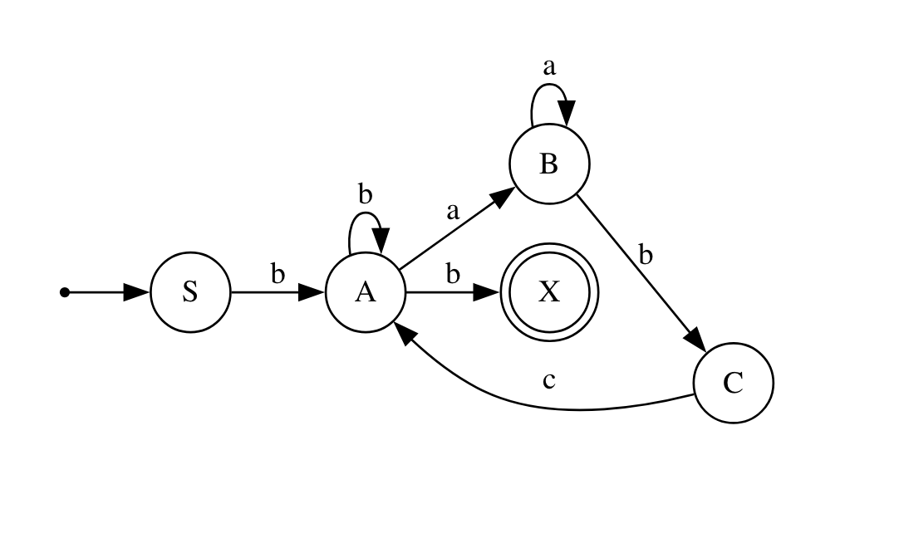

# Intro to formal languages. Regular grammars. Finite Automata.

### Course: Formal Languages & Finite Automata
### Author: Adrian Vremere 

----

## Theory

### Formal Languages and Automata

Formal languages are a fundamental concept in computer science, particularly in compiler design and language processing. A **formal language** consists of a set of strings formed from an alphabet, following specific rules.

### Alphabet and Strings
- An **alphabet (Σ)** is a finite, nonempty set of symbols (e.g., Σ = {0,1} for binary).
- A **string (word)** is a finite sequence of symbols from Σ (e.g., 1011).
- The **empty string (ε)** contains no symbols.
- The **length of a string** is denoted by |w| (e.g., |101| = 3).

### Languages
A **language (L)** is a set of strings over an alphabet. It can be finite or infinite:
- Example: L = {w | w contains an equal number of 0’s and 1’s}.
- Operations on languages include **union, intersection, concatenation, and closure**.

### Grammars and Chomsky Hierarchy
A **grammar (G)** is defined as **G = (VN, VT, P, S)**, where:
- **VN**: Non-terminal symbols.
- **VT**: Terminal symbols.
- **P**: Production rules.
- **S**: Start symbol.

The **Chomsky hierarchy** classifies grammars into four types:
1. **Type 0**: Recursively enumerable grammars (most general).
2. **Type 1**: Context-sensitive grammars.
3. **Type 2**: Context-free grammars (CFGs).
4. **Type 3**: Regular grammars (least powerful).

### Finite Automata
A **finite automaton** is an abstract computational model used to recognize languages. It consists of states and transitions based on input symbols.

#### Deterministic Finite Automaton (DFA)
A DFA is defined as **(Q, Σ, δ, q0, F)** where:
- **Q**: Finite set of states.
- **Σ**: Input alphabet.
- **δ**: Transition function (δ: Q × Σ → Q).
- **q0**: Start state.
- **F**: Set of accepting (final) states.

#### Nondeterministic Finite Automaton (NFA)
An NFA allows multiple possible transitions from a state, including **ε-transitions** (moves without consuming input). NFAs can be converted to equivalent DFAs.

#### Regular Expressions and Regular Languages
Regular expressions define **regular languages**, which are languages that can be recognized by finite automata. These expressions use operators like:
- **Concatenation** (e.g., `ab` means "a" followed by "b").
- **Union** (e.g., `a|b` means "a" or "b").
- **Kleene star** (e.g., `a*` means "zero or more repetitions of a").

Finite automata and regular expressions form the foundation for lexical analysis in compilers, pattern matching in text processing, and protocol verification.


##  Objectives:

1. Discover what a language is and what it needs to have in order to be considered a formal one;

2. Provide the initial setup for the evolving project that you will work on during this semester. You can deal with each laboratory work as a separate task or project to demonstrate your understanding of the given themes, but you also can deal with labs as stages of making your own big solution, your own project. Do the following:

    a. Create GitHub repository to deal with storing and updating your project;

    b. Choose a programming language. Pick one that will be easiest for dealing with your tasks, you need to learn how to solve the problem itself, not everything around the problem (like setting up the project, launching it correctly and etc.);

    c. Store reports separately in a way to make verification of your work simpler (duh)

3. According to your variant number, get the grammar definition and do the following:

    a. Implement a type/class for your grammar;

    b. Add one function that would generate 5 valid strings from the language expressed by your given grammar;

    c. Implement some functionality that would convert and object of type Grammar to one of type Finite Automaton;

    d. For the Finite Automaton, please add a method that checks if an input string can be obtained via the state transition from it;


## Implementation description

```java
public class Main {
    public static void main(String[] args) {

        Scanner scanner = new Scanner(System.in);

        List<String> terminals = Arrays.asList("a", "b");
        List<String> nonTerminals = Arrays.asList("S", "A", "B", "C");
        Map<String, List<String>> rules = new HashMap<>();
        rules.put("S", Arrays.asList("bA"));
        rules.put("A", Arrays.asList("b", "aB", "bA"));
        rules.put("C", Arrays.asList("cA"));
        rules.put("B", Arrays.asList("bC", "aB"));

        Grammar grammar = new Grammar(terminals, nonTerminals, rules, "S");
        System.out.println("\nGrammar: ");
        System.out.println(grammar);

        FiniteAutomaton automaton = grammar.toFiniteAutomaton();
        System.out.println("\nFinite Automaton: ");
        System.out.println(automaton);
        
        System.out.println("\n5 generated strings: ");
        for (int i = 0; i < 5; i++) {
            String generatedString = grammar.generateString();
            System.out.println("\n\tGenerated word: " + generatedString);
            System.out.println("\tBelongs to language: " + automaton.stringBelongToLanguage(generatedString));
        }
    }
}
```


In the `main()` method from `Main`, I initialize a **context-free grammar** by defining lists for **terminals**, **non-terminals**, and a `HashMap` to store **production rules**, which are then passed to the `Grammar` class. The `toFiniteAutomaton()` method is called to convert the grammar into a **finite automaton**, and its structure is printed. Using the `generateString()` method, I generate **random words**, verify their validity using `stringBelongToLanguage()`, and display the results. Additionally, a `Scanner` is used to allow users to **manually test strings**, with a loop that continues accepting input until an empty line is entered.  


```java
public String generateString() {
        String result = start;
        while (hasNonTerminals(result)) {
            for (String nonTerminal : nonTerminals) {
                if (result.contains(nonTerminal)) {
                    result = result.replaceFirst(nonTerminal,
                            rules.get(nonTerminal).get(random.nextInt(rules.get(nonTerminal).size())));
                    continue;
                }
            }
        }
        return result;
    }

```

The `generateString()` method from the `Grammar` class generates a **random string** starting from the `start` symbol by continuously replacing non-terminals with their corresponding production rules. It uses `hasNonTerminals(result)` to check if the string still contains any **non-terminals**. A `for` loop iterates through the `nonTerminals` list, and when a non-terminal is found in `result`, `replaceFirst()` is used to substitute it with a randomly chosen production rule, selected using `random.nextInt()`. This process repeats until no non-terminals remain, at which point the final generated string is returned.  

```java
public FiniteAutomaton toFiniteAutomaton() {
        List<String> alphabet = new ArrayList<>(this.terminals);
        List<String> states = new ArrayList<>(this.nonTerminals);
        states.add("X");
        String initialState = this.start;
        String finalState = "X";
        Map<Transition, List<String>> transitions = new HashMap<>();

        for (String nonTerminal : rules.keySet()) {
            for (String result : rules.get(nonTerminal)) {
                // String input = (Character.isLowerCase(result.charAt(0))) ? Character.toString(result.charAt(0)) : "";
                // Transition transition = new Transition(nonTerminal, input);
                Transition transition = new Transition(nonTerminal, Character.toString(result.charAt(0)));
                transitions.putIfAbsent(transition, new ArrayList<>());
                transitions.get(transition).add(Character.toString((result.length() > 1) ? result.charAt(1) : 'X'));
            }
        }
        
        return new FiniteAutomaton(alphabet, states, initialState, finalState, transitions);
    }
```
The `toFiniteAutomaton()` method from `Grammar` **converts the grammar into a finite automaton** by constructing states, transitions, and other necessary components. The **alphabet** is initialized from `terminals`, while **states** are derived from `nonTerminals`, with an additional final state `"X"`. The **initial state** is set to `start`, and the final state is `"X"`. A **transition map** (`transitions`) is created by iterating over `rules`, where each **non-terminal** is mapped to a transition based on its production rules. A `Transition` object is created for each rule, using the first character as input, and the second character (if present) is placed as an output state in a list associated with that transition. If no second character exists, the state is considered final.  

```java
public class Transition {
    private String state;
    private String input;

    public Transition(String state, String input) {
        this.state = state;
        this.input = input;
    }
}
```
The class `Transition` represents a **state transition** in the finite automaton with a **current state** and an **input symbol**.

```java
    public boolean stringBelongToLanguage(final String inputString) {
        if (inputString == null || inputString.isEmpty()) {
            return false;
        }

        return stringBelongToLanguage(Arrays.asList(this.initialState),inputString);
    }

    public boolean stringBelongToLanguage(List<String> possibleStates, final String inputString) {
        if (possibleStates == null) {
            return false;
        }

        if (inputString.isEmpty()) {
            return possibleStates.contains(this.finalState);
        }

        for (String possibleState : possibleStates) {
            Transition transition = new Transition(possibleState, Character.toString(inputString.charAt(0)));
            if (stringBelongToLanguage(this.transitions.get(transition), inputString.substring(1))) {
                return true;
            }
        }


        return false;
        
    }
```
The `stringBelongToLanguage(final String inputString)` method first **validates the input** and calls the recursive version with the **initial state**. The recursive method `stringBelongToLanguage(List<String> possibleStates, final String inputString)` processes the string **character by character**, checking transitions stored in `this.transitions`. If `inputString` is empty, it returns `true` if a **final state** is reached. Otherwise, it creates a `Transition` for the first character, finds possible next states, and recursively checks the remaining string. The method ultimately returns `true` if any path leads to the final state; otherwise, it returns `false`.  
  
## Conclusions / Screenshots / Results

### Results
```
Grammar: 
G = (Vn, Vt, S, P)
Vn = {S, A, B, C}
Vt = {S, A, B, C}
P = {
        A --> b | aB | bA
        B --> bC | aB
        S --> bA
        C --> cA
    }
```
The first part of output is the grammar in a string format based on the variant.

```
Finite Automaton: 
Q = {S, A, B, C, X}
Σ = {a ,b}
q0 = S
F = X
        δ(B, a) = {B}
        δ(S, b) = {A}
        δ(A, a) = {B}
        δ(B, b) = {C}
        δ(C, c) = {A}
        δ(A, b) = {X, A}
```
The second part is the Finite Automaton converted from the previous grammar.
```
5 generated strings: 

        Generated word: babcbbb
        Belongs to language: true

        Generated word: bb
        Belongs to language: true

        Generated word: babcbabcbaabcaabcabcbabcb
        Belongs to language: true

        Generated word: bb
        Belongs to language: true

        Generated word: bbb
        Belongs to language: true
```
Then 5 strings are generated by the `generateString()` method. The strings are shown to the screen also validated by the Finite Automaton with the method `stringBelongToLanguage()`.

```
Do you want to check a string? (y/n)
y
Enter the word(empty line to exit): baab
Belongs to language: false
Enter the word(empty line to exit): bbb
Belongs to language: true
```
The final part asks the user if they want to check any custom strings. The strings will be checked by `stringBelongToLanguage()` based on the variant rules. The user will be informed if the strings belongs or not to the language.


### Conclusions
<p align="center">
  
</p>


During this lab on **Introduction to Formal Languages, Regular Grammars, and Finite Automata**, I gained a deeper understanding of **alphabets, languages, their classifications, formal grammars, and finite automata (FA)**. I successfully set up a **GitHub repository** for my evolving project and chose **Java** as the programming language to implement the required tasks. As part of my assignment, I developed a `Grammar` class, which includes the `generateString()` method for generating valid strings based on production rules and the `toFiniteAutomaton()` method for converting the grammar into a **Finite Automaton**. Additionally, I implemented a `FiniteAutomaton` class, where the `stringBelongToLanguage()` method checks whether a given string can be derived through state transitions using recursion. Throughout this process, I improved my understanding of **Regular Grammars**, their differences from other grammar types, and how to convert them into **Finite Automata**. To further enhance my learning, I used **Graphviz** to create a **visual representation** of my FA, making it easier to analyze state transitions.  


## References
<a id="ref1"></a>[1] Laboratory Work 1: Intro to formal languages. Regular grammars. Finite Automata. task.md - Crețu Dumitru, Drumea Vasile, Cojuhari Irina - 
https://github.com/filpatterson/DSL_laboratory_works/blob/master/1_RegularGrammars/task.md

<a id="ref2"></a>[2] "Formal Languages and Finite Automata guide for practical lessons" - COJUHARI Irina, DUCA Ludmila, FIODOROV Ion - 
https://else.fcim.utm.md/pluginfile.php/110458/mod_resource/content/0/LFPC_Guide.pdf

<a id="ref3"></a>[3] Presentation on "Formal Languages and Compiler Design" - conf. univ., dr. Irina Cojuhari - 
https://else.fcim.utm.md/pluginfile.php/110457/mod_resource/content/0/Theme_1.pdf

<a id="ref4"></a>[4] Presentation on "Regular Language. Finite Automata" - TUM - 
https://drive.google.com/file/d/1rBGyzDN5eWMXTNeUxLxmKsf7tyhHt9Jk/view

<a id="ref5"></a>[5] Graphviz Visual Editor - magjac Interactive - https://magjac.com/graphviz-visual-editor/
